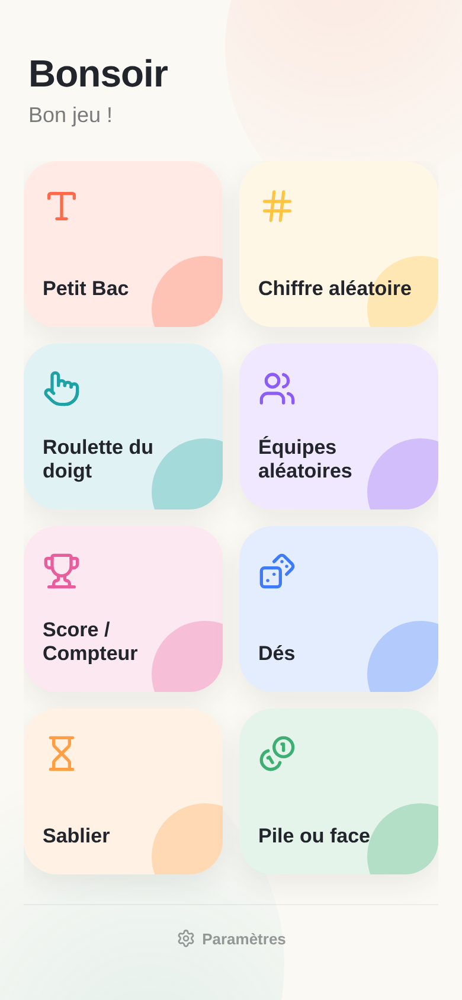

# Topla


Boîte à outils pour animer vos parties de jeux de société. Installable comme application (PWA), fonctionne entièrement hors ligne.



## Outils

- **Petit Bac** — tire une lettre de l'alphabet au hasard (jamais deux fois la même d'affilée), avec historique des lettres tirées.
- **Chiffre aléatoire** — tire un chiffre de 0 à 9.
- **Roulette du doigt** — chaque joueur pose un doigt sur l'écran, un compte à rebours désigne un doigt au hasard parmi ceux posés.
- **Équipes aléatoires** — ajoutez des joueurs, choisissez un nombre d'équipes, répartition équilibrée aléatoire.
- **Score / Compteur** — un compteur de points par joueur (+1/-1, +5 en appui long), classement en temps réel avec podium.
- **Dés** — de 1 à 6 dés, lancer au tap ou en secouant le téléphone.
- **Sablier** — décompte avec presets rapides ou durée personnalisée, vibration et son à la fin.
- **Pile ou face** — lancer de pièce classique.

Les joueurs, équipes et scores sont sauvegardés sur l'appareil (localStorage) pour reprendre une partie interrompue. Un écran **Paramètres** (discret, en bas de l'accueil) permet de voir l'espace utilisé et de tout effacer.

## Installer l'application

Ouvrez l'app dans un navigateur mobile (Chrome, Safari...) puis :

- **Android / Chrome** : menu → "Ajouter à l'écran d'accueil" (ou bannière d'installation automatique).
- **iOS / Safari** : bouton Partager → "Sur l'écran d'accueil".

Une fois installée, un appui long sur l'icône propose des raccourcis directs vers Petit Bac, Roulette, Score et Dés.

## Stack technique

HTML / CSS / JS vanilla — aucune dépendance externe, aucun build, aucune police ou CDN externe (uniquement les polices système). Icônes inline au format [Lucide](https://lucide.dev/).

```
index.html
manifest.json          manifeste PWA (icônes, shortcuts, screenshots)
sw.js                   service worker (cache-first + revalidation réseau)
css/style.css
js/
  app.js                routeur SPA (hash-based) + salutation dynamique
  modal.js               modal de confirmation réutilisable
  lettre.js, chiffre.js, roulette.js, equipes.js,
  score.js, des.js, sablier.js, pile-face.js, parametres.js
icons/                  icônes app (192/512 + variantes maskable)
screenshots/            captures utilisées par le manifeste PWA
```

## Développement local

Aucun outil de build requis. Servez le dossier avec n'importe quel serveur statique :

```
python3 -m http.server 8000
```

Puis ouvrez `http://localhost:8000`.

## Licence

GPL-3.0, voir [LICENSE](LICENSE).
