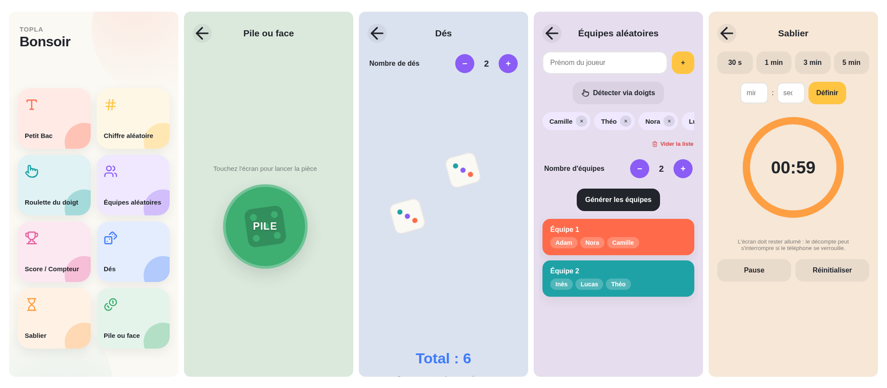

# Topla


Boîte à outils pour animer vos parties de jeux de société. Installable comme application (PWA), fonctionne entièrement hors ligne.



## Outils

- **Petit Bac** — tire une lettre au hasard (jamais deux fois la même d'affilée), avec historique.
- **Chiffre aléatoire** — tire un chiffre de 0 à 9.
- **Roulette du doigt** — chaque joueur pose un doigt, un compte à rebours en désigne un au hasard.
- **Équipes aléatoires** — ajoutez des joueurs, choisissez un nombre d'équipes, répartition équilibrée.
- **Score / Compteur** — points par joueur (+1/-1, +5 en appui long), classement en temps réel.
- **Dés** — 1 à 6 dés, lancer au tap ou en secouant le téléphone.
- **Sablier** — presets rapides ou durée personnalisée, vibration et son à la fin.
- **Pile ou face** — lancer de pièce classique.

Joueurs, équipes et scores sont sauvegardés sur l'appareil (localStorage). Un écran **Paramètres** (en bas de l'accueil) permet de voir l'espace utilisé et de tout effacer.

## Langues

- Français à la racine (`/lettre`, `/score`, …), anglais sous `/en/...` — routing i18n natif d'Astro.
- URLs anglaises traduites, pas juste préfixées : `/lettre` → `/en/letter`, `/des` → `/en/dice`, `/sablier` → `/en/timer`, etc.
- Au premier chargement, la langue du navigateur est détectée une seule fois puis mémorisée (`localStorage`) — aucune redirection forcée ensuite.
- Sélecteur FR/EN manuel dans Paramètres.
- Toute chaîne (pages et scripts) vient d'une seule source : `src/i18n/translations.js`.

## Installer l'application

Ouvrez l'app dans un navigateur mobile puis :

- **Android / Chrome** : menu → "Ajouter à l'écran d'accueil".
- **iOS / Safari** : bouton Partager → "Sur l'écran d'accueil".

Une fois installée, un appui long sur l'icône propose des raccourcis vers Petit Bac, Roulette, Score et Dés.

## Stack technique

- [Astro](https://astro.build/) v7, sortie 100 % statique, adaptateur [`@astrojs/cloudflare`](https://docs.astro.build/en/guides/integrations-guide/cloudflare/) pour le déploiement Workers.
- Aucun framework UI, aucune police ou CDN externe. Icônes inline [Lucide](https://lucide.dev/).
- Multi-page : chaque outil est une route Astro autonome, pas de routeur côté client.

Fichiers clés :

- `astro.config.mjs` — build statique, i18n fr/en, sitemap.
- `wrangler.jsonc` — config Cloudflare Workers (`assets.directory`, `build.command`).
- `src/i18n/translations.js` — dictionnaire fr/en + table de correspondance des slugs d'URL.
- `src/layouts/Layout.astro` — `<head>` commun + script détection/redirection langue.
- `src/components/tools/` — un composant par outil (`lang="fr"|"en"`), rendu par les pages.
- `src/pages/` (fr) et `src/pages/en/` (en) — routes fines qui instancient les composants.
- `public/` — copié tel quel dans `dist/` (pas de hash de fichier, requis pour que `sw.js` précache des noms stables) : `manifest.json`, `sw.js`, `css/`, `js/`, `icons/`, `screenshots/`.
- `scripts/generate-commit-info.js` — génère `public/js/commit-info.js`, affiché dans Paramètres.

## Développement local

Installer les dépendances :

```
npm install
```

Lancer le serveur de dev (astro dev, hot reload) :

```
npm run dev
```

Builder pour la prod (→ `dist/`) :

```
npm run build
```

Prévisualiser en conditions réelles (build + wrangler dev sur `dist/`) :

```
npm run preview
```

`scripts/generate-commit-info.js` tourne automatiquement avant `dev` et `build` (`predev`/`prebuild`), aussi en prod via `wrangler.jsonc` → `build.command`.

## Contribuer

Commits en [Conventional Commits](https://www.conventionalcommits.org/) (`feat:`, `fix:`, `refactor:`, `docs:`, `chore:`, …).

## Transparence

Ce projet a été développé avec l'aide d'une IA (Claude Code) — transparence, et du temps gagné pour jouer à nos jeux de société.

## Licence

GPL-3.0, voir [LICENSE](LICENSE).
